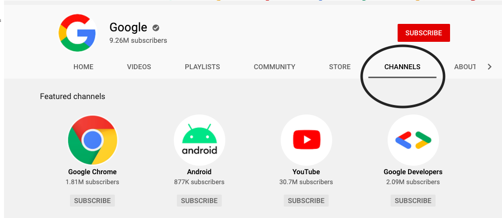
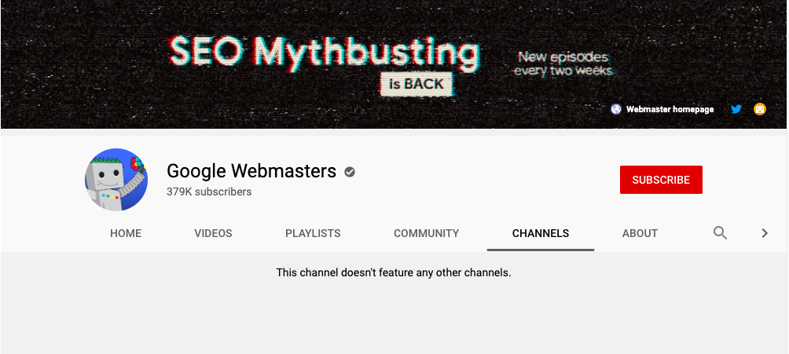
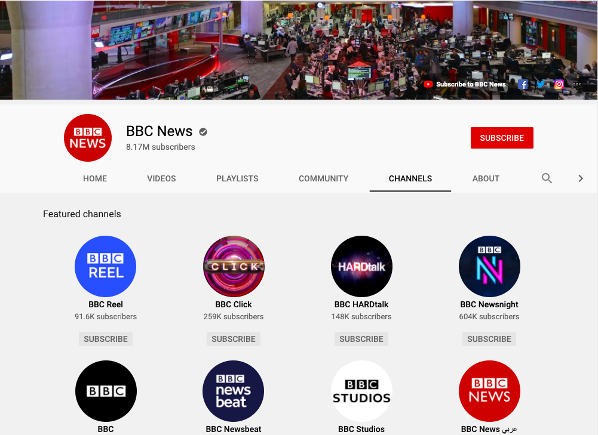

# Read Me

## Purpose

The purpose of this project is to create a tool that can plot graphs of YouTube channels by crawling through featured channels on a profile page. This graph can then be used to analyze each channels' relative significance in that network. 

In this approach we start off with a list of channels as our point of origin, extract the list of channels featured on each profile page, and then repeat the process `n` times.

This will produce be a directional graph, for instance `channel A` might point to `channel B,` but `channel B` might not point to `channel A.`

**Note:** Due to the crawling nature of this project, the analysis is relative to this subset of channels in the YouTube universe, therefore the statistics will change for different sized networks containing different points of origin.

## Context
Each channel has an option to feature other youtube channels on their profile page. This appears on their profile page as a tab. As in this example for Google's YouTube channel.

Many channels do not feature other channels on their profile pages. Such as with Google's Webmasters YouTube channel

Some channels exclusively feature channels within their business network.
For example BBC.

Although a lot of channels feature channels with similar contexts, channels of friends, and/or collaborating channels. Such as Corridor Crew, The Slow Mo Guys, and Smarter Every Day.

## Summary

## Objective
To create a dash app that uses networkX and plotly to generate a graph of featured channels for a select list of channels as our point of origin, and to conduct statstical analysis on significant nodes in the network and on the connectivity of the graph.

## Collecting Data
The data come from Google's [Youtube Data Api v3](https://developers.google.com/youtube/v3/docs). I created a GCP project, generated an API key, and used two API endpoints; specifically `youtube.search.list` and `youtube.channels.list`.

The API-key lives in a config.py file, which was excluded from this repo for security purposes. If you would like to replicate this project: create a GCP project, generate an API key, and write a config.py file to reference that API-key. The quota limit is 10,000 units per day. `youtube.search.list` costs 100 units per request, while `youtube.channels.list` costs 1 unit per request.

Results

Use

Conclusion

Next Steps