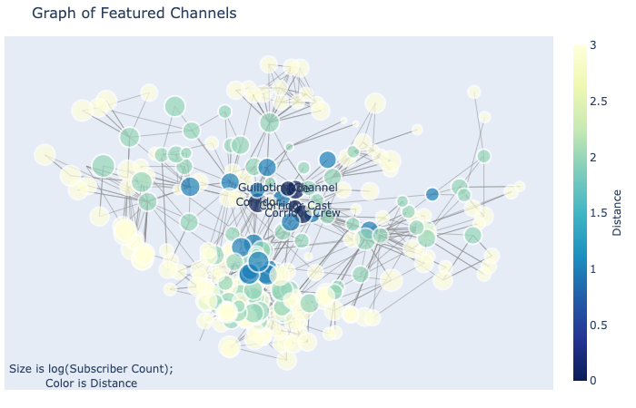
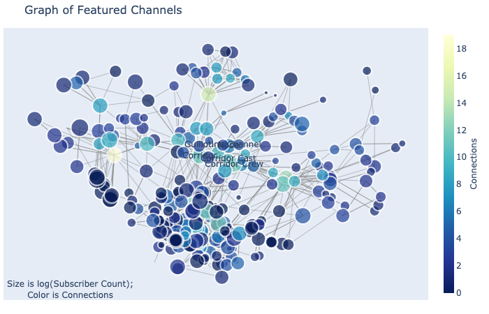
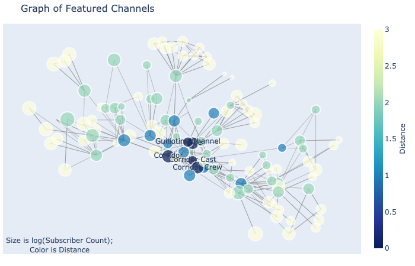
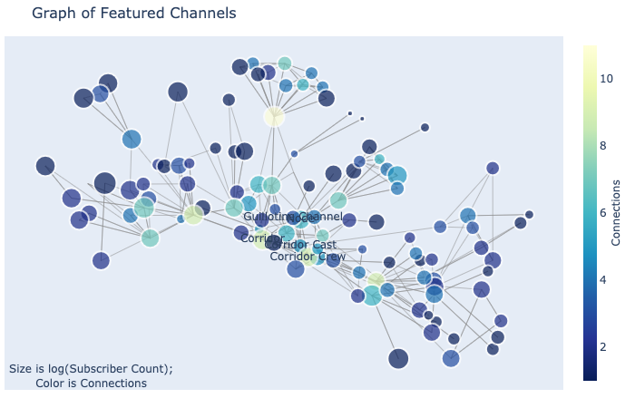

# Read Me

## Purpose

The purpose of this project is to create a tool that can plot graphs of YouTube channels by crawling through featured channels on a profile page. This graph can then be used to analyze each channels' relative significance in that network. 

In this approach we start off with a list of channels as our point of origin, extract the list of channels featured on each profile page, and then repeat the process `n` times.

This will produce be a directional graph, for instance `channel A` might point to `channel B,` but `channel B` might not point to `channel A.`

**Note:** Due to the crawling nature of this project, the analysis is relative to this subset of channels in the YouTube universe, therefore the statistics will change for different sized networks containing different points of origin.

--------------

## Context
Each channel has an option to feature other youtube channels on their profile page. This appears on their profile page as a tab. As in this example for Google's YouTube channel.


Many channels do not feature other channels on their profile pages. Such as with Google's Webmasters YouTube channel


Some channels exclusively feature channels within their business network.
For example BBC.


Although a lot of channels feature channels with similar contexts, channels of friends, and/or collaborating channels. Such as Corridor Crew, The Slow Mo Guys, and Smarter Every Day.

-----------------------------
## Objective
To create a dash app that uses networkX and plotly to generate a graph of featured channels for a select list of channels as our point of origin, and to conduct statstical analysis on significant nodes in the network and on the connectivity of the graph.

## Collecting Data
The data come from Google's [Youtube Data Api v3](https://developers.google.com/youtube/v3/docs). I created a GCP project, generated an API key, and used two API endpoints; specifically `youtube.search.list` and `youtube.channels.list`.

The API-key lives in a config.py file, which was excluded from this repo for security purposes. If you would like to replicate this project: create a GCP project, generate an API key, and write a config.py file to reference that API-key. **The quota limit is 10,000 units per day.**
 - `youtube.search.list` costs **100 units** per request
 - `youtube.channels.list` costs **1 unit** per request

## The Data - using jsons and structuring data
The `youtube.channels.list` endpoint returns a json with a variety of parts about the channelId requested.

```
['kind', 'etag', 'id', 'snippet', 'contentDetails', 'statistics', 'topicDetails', 'status', 'brandingSettings', 'contentOwnerDetails']
```


## Graphs

Show the types of graphs (Directional Graph, Undirected Graph, strongly connected components)

Graph of Corridor Digital's 3-distance featured network



Graph of Corridor Digital's strongly connected components in their 3-distance featured network




## Statstics

Degree, In Degree, Out Degree, Betweenness Centrality, In Degree Centrality, Page Rank


Top 8 channels by Betweenness Centrality;

|    | title           |   page_rank |   featuredChannelsCount |   degree |   in_degree |   betweenness_centrality |   in_degree_centrality |   subscriberCount |   viewCount |
|---:|:----------------|------------:|------------------------:|---------:|------------:|-------------------------:|-----------------------:|------------------:|------------:|
|  1 | Corridor        |   0.0337084 |                      11 |       29 |          18 |                0.197719  |              0.0608108 |           8080000 |  1469507306 |
|  2 | Corridor Crew   |   0.0399649 |                      12 |       20 |           8 |                0.112594  |              0.027027  |           4110000 |   713277250 |
| 10 | devinsupertramp |   0.0127246 |                      10 |       25 |          15 |                0.10919   |              0.0506757 |           5920000 |  1438824815 |
| 22 | Nukazooka       |   0.02434   |                       8 |       19 |          11 |                0.0826987 |              0.0371622 |           2260000 |   670559796 |
| 23 | Mike Diva       |   0.0112591 |                       7 |       15 |           8 |                0.0796148 |              0.027027  |            650000 |   142893349 |
|  9 | Film Riot       |   0.0155565 |                      13 |       23 |          10 |                0.0792312 |              0.0337838 |           1670000 |   191825386 |
| 15 | SoKrispyMedia   |   0.0152009 |                      10 |       18 |           8 |                0.0741729 |              0.027027  |           1150000 |   319054747 |
|  0 | Corridor Cast   |   0.0219452 |                      10 |       14 |           4 |                0.0515002 |              0.0135135 |            111000 |     5011173 |

Top 8 channels by Indegree Centrality;

|    | title           |   page_rank |   featuredChannelsCount |   degree |   in_degree |   betweenness_centrality |   in_degree_centrality |   subscriberCount |   viewCount |
|---:|:----------------|------------:|------------------------:|---------:|------------:|-------------------------:|-----------------------:|------------------:|------------:|
|  1 | Corridor        | 0.0337084   |                      11 |       29 |          18 |              0.197719    |              0.0608108 |           8080000 |  1469507306 |
| 10 | devinsupertramp | 0.0127246   |                      10 |       25 |          15 |              0.10919     |              0.0506757 |           5920000 |  1438824815 |
| 92 | TomSka          | 0.0167781   |                      15 |       28 |          13 |              0.0492833   |              0.0439189 |           6440000 |  1657474725 |
| 44 | LetsPlay        | 3.69413e-17 |                       1 |       12 |          11 |              1.71782e-05 |              0.0371622 |           3850000 |  2437731719 |
| 22 | Nukazooka       | 0.02434     |                       8 |       19 |          11 |              0.0826987   |              0.0371622 |           2260000 |   670559796 |
| 20 | RocketJump      | 1.44605e-10 |                       3 |       13 |          10 |              0.0258455   |              0.0337838 |           9000000 |  1904596631 |
|  9 | Film Riot       | 0.0155565   |                      13 |       23 |          10 |              0.0792312   |              0.0337838 |           1670000 |   191825386 |
| 14 | Rooster Teeth   | 0.000467877 |                      12 |       21 |           9 |              0.018583    |              0.0304054 |           9470000 |  6081509776 |

Top 8 channels by Page Rank;

|     | title             |   page_rank |   featuredChannelsCount |   degree |   in_degree |   betweenness_centrality |   in_degree_centrality |   subscriberCount |   viewCount |
|----:|:------------------|------------:|------------------------:|---------:|------------:|-------------------------:|-----------------------:|------------------:|------------:|
|  35 | TechLinked        |   0.0509535 |                       6 |       12 |           6 |              5.72607e-06 |              0.0202703 |           1260000 |   183056413 |
|  50 | LMG Clips         |   0.0509535 |                       6 |       12 |           6 |              5.72607e-06 |              0.0202703 |            178000 |    20307801 |
|  65 | Carpool Critics   |   0.0509535 |                       6 |       11 |           5 |              0           |              0.0168919 |             42400 |      425975 |
|  76 | ShortCircuit      |   0.0509535 |                       6 |       11 |           5 |              0           |              0.0168919 |            948000 |    56517459 |
|  18 | Linus Tech Tips   |   0.0509535 |                       6 |       13 |           7 |              0.0079077   |              0.0236486 |          11500000 |  3924848893 |
|  89 | Techquickie       |   0.0509535 |                       6 |       12 |           6 |              5.72607e-06 |              0.0202703 |           3530000 |   527112792 |
|   2 | Corridor Crew     |   0.0399649 |                      12 |       20 |           8 |              0.112594    |              0.027027  |           4110000 |   713277250 |
| 105 | Channel Super Fun |   0.035747  |                       4 |       10 |           6 |              0           |              0.0202703 |            740000 |    97736777 |

## Dash Appplication Use
This tool can be used to assess any community of channels and their subsequent n-distance network. 

------------------------
# Conclusion

## Next Steps

There are a lot of questions that this analysis does not answer. There are also a lot of features that I can add to this tool. 

### Next Questions
 - Analyzing the universe of YouTube Videos. 
 - Expanding the size of nodes.
 - Adding a weight to page rank and other metrics based on subscriber count and total views.

### Next Features
 - I would like to allow a user to select a variety of differing channels and watch how they link between separate networks. 
 - Take advantage of selection feature in Plotly.